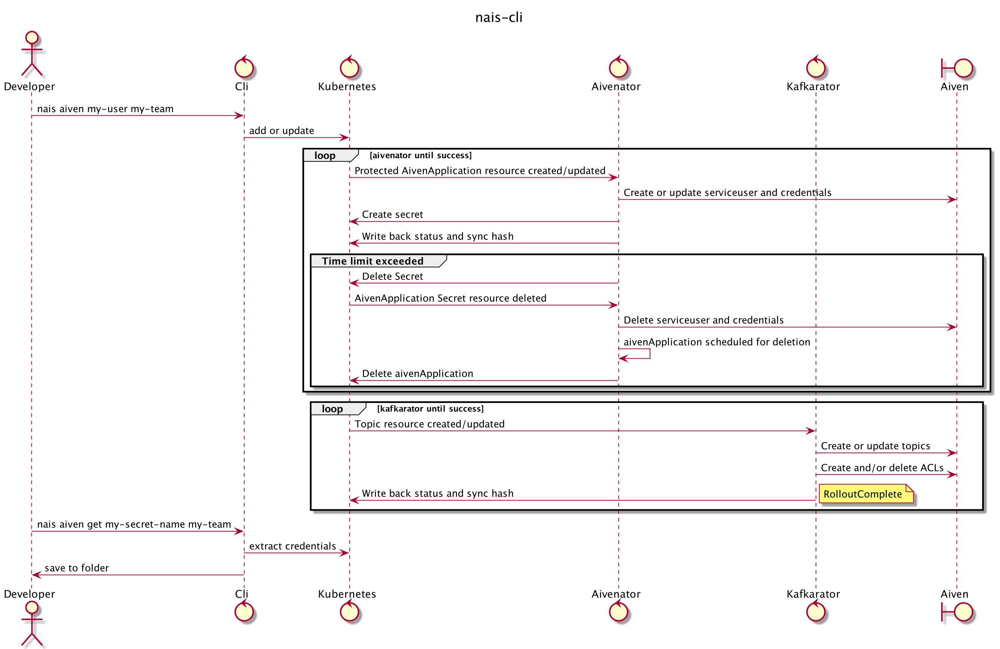

# nais-cli

## Prerequisite

* Authentication & Authorization
    * Connect to [naisdevice](https://doc.nais.io/device/)
    * Tool is used in GCP? please be sure to log in:

```
gcloud auth login --update-adc
```

Be sure to set

```
export KUBECONFIG="<path-to>/kubeconfigs/config"
```

More info in [kubeconfigs](https://github.com/navikt/kubeconfigs)

## Install

First

```
brew tap nais/tap
```

then

```
brew install nais-cli  
```

check

```
nais-cli version
```

You should be able to use

```
nais-cli [commands] [args] [flags]
```

## Commands

Available commands:

- aiven
- version
- get

### aiven

Aiven Kafka Debug Command to apply a `aivenApplication` and extract its credentials. `avien` command will apply
an [Protected](https://doc.nais.io/persistence/kafka/#accessing-topics-from-an-application-on-legacy-infrastructure) `aivenApplication`
in your specified namespace=`team`. This will give access to personal but time limited credential. These credentials can
be used to debug an Aiven hosted kafka topic. `aiven get` command extracts the fresh `aivenApplication` credentials and
puts them in `current` folder. The applied `aivenApplication` has a default `expireAt` and is set to 1 day.

To gain access be sure to update
your [topic](https://doc.nais.io/persistence/kafka/#creating-topics-and-defining-access) resource & ACLs add `username`
to your `Topic`.yaml ACLs and apply to your namespace.

When secrets is extracted you can install and use [kcat](https://github.com/edenhill/kcat) (kcat is the project formerly
known as kafkacat) in preferred way.

#### Commands & Flags

Flags provide modifiers to control how the action command operates.

For help on individual commands, add `--help` short: `-h`.

##### Required

###### aiven

* `username` must be passed as **fist** argument after command: Prefix before `@nav.no`.

* `team` must be passed as **second** argument after command: team-namespace (default namespace not supported).

###### get

* `secret-name` must be passed as **fist** argument after command, Secret-name for your aiven application.

* `team` must be passed as **second** argument after command, team-namespace (default namespace not supported).

##### Optional

###### aiven

* `--pool` short `-p` default: `nav-dev`: Preferred kafka pool.

* `--expire` short `-e` default: `1`: Time in days the created secret should be valid.

* `--secret-name` short `-s` default: `namespace-username-(random-id)`: Preferred secret-name instead of the generated.

###### get

* `--dest` short `-d` default: `current`: Path to directory where secrets will be dropped of. For `current` with
  subfolder folder, e.g: `/.config`

* `--config` short `-c`: default: `all`: Config type, `all || kcat || .env`. `all` generates both .env and kcat config
  files.

###### version

* `--commit` short `-i` default: `false` : Get detailed information about this `nais-cli` version

#### Available configuration files

After Successful `nais-cli` command a set of files will be available in `current` folder.

##### .env

- client-keystore.p12
- client-truststore.jks
- kafka-ca.cert
- kafka-certificate.crt
- kafka-private-key.pem
- kafka-secret.env

##### kafka-secret.env

```Properties
KAFKA_BROKERS:brokerurl.aivencloud.com:26484
KAFKA_PRIVATE_KEY=/path/to/kafka-private-key.pem
client.keystore.p12=/path/to/client-keystore.p12
client.truststore.jks=/path/to/.envs/client-truststore.jks
KAFKA_CA=/path/to/.envs/kafka-ca.cert
KAFKA_CERTIFICATE=/path/to/.envs/kafka-certificate.crt
KAFKA_CREDSTORE_PASSWORD:password
KAFKA_SCHEMA_REGISTRY:https://registry-url.aivencloud.com:26487
KAFKA_SCHEMA_REGISTRY_PASSWORD:password
KAFKA_SCHEMA_REGISTRY_USER:my-user
```

##### kcat

- kafka-ca.cert
- kafka-certificate.crt
- kafka-private-key.pem
- kcat.conf

##### kcat.conf

```Properties
# nais-cli 2021-09-01 15:26:00
# kcat -F kcat.conf
ssl.key.location=/path/to/current/folder/creds/my-username-kafka-private-key.pem
ssl.certificate.location=/path/to/current/folder/creds/my-username-kafka-certificate.crt
ssl.key.password=changeme
bootstrap.servers=https://boostrap-server.aivencloud.com:26484
ssl.ca.location=/path/to/current/folder/creds/my-user-kafka-ca.cert
security.protocol=ssl
```

##### All

- client-keystore.p12
- client-truststore.jks
- kafka-ca.cert
- kafka-certificate.crt
- kafka-private-key.pem
- kafka-secret.env
- kcat.conf

`kcat.conf` can be used with [aiven-kcat](https://help.aiven.io/en/articles/2607674-using-kafkacat) to authenticate
against the Aiven hosted topics in GCP.

You can refer to this config with -F flag:

```
kcat -F kcat.conf
```

Alternatively, you can specify the same settings directly on the command line:

```
kcat \
    -b https://boostrap-server.aivencloud.com:26484 \
    -X security.protocol=ssl \
    -X ssl.key.location=service.key \
    -X ssl.certificate.location=service.cert \
    -X ssl.ca.location=ca.pem
```

For more details [aiven-kcat-help](https://help.aiven.io/en/articles/2607674-using-kafkacat)

## Flow



## Local Development

* Be sure to run your local cluster, recommend: [minkube](https://minikube.sigs.k8s.io/docs/start/).

Start minikube with a version < 1.22,
reason: [Feature removals](https://kubernetes.io/blog/2021/07/14/upcoming-changes-in-kubernetes-1-22/).

```
minikube start --kubernetes-version=v1.21.4
```

* Apply liberator CRDs.

```
kubectl apply -f path/to/liberator/crd/bases
```

* Create a `test` cluster.

```
kubectl create namespace test
```

* Create a [secret](https://doc.nais.io/persistence/kafka/#application-config) containing this data.

```yaml
apiVersion: v1
data:
  KAFKA_BROKERS: ...
  KAFKA_CA: ...
  KAFKA_CERTIFICATE: ...
  KAFKA_CREDSTORE_PASSWORD: ...
  KAFKA_PRIVATE_KEY: ...
  KAFKA_SCHEMA_REGISTRY: ...
  KAFKA_SCHEMA_REGISTRY_PASSWORD: ...
  KAFKA_SCHEMA_REGISTRY_USER: ...
  client.keystore.p12: ...
  client.truststore.jks: ...
kind: Secret
metadata:
  annotations:
    aivenator.aiven.nais.io/protected: "true"
    aivenator.aiven.nais.io/with-time-limit: "true"
    kafka.aiven.nais.io/pool: nav-test
    kafka.aiven.nais.io/serviceUser: service-user
  finalizers:
    - aivenator.aiven.nais.io/finalizer
  labels:
    team: test
    type: aivenator.aiven.nais.io
  name: test-user
  namespace: test
type: Opaque
```

```
kubectl apply -f path/to/secret
```

* Generate executable program and test your changes.

```
make nais-cli
```