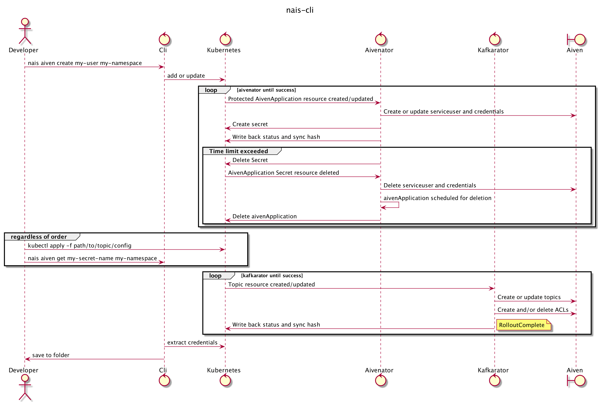

# aiven

## Flow



## Local development

* Create a [secret](https://doc.nais.io/persistence/kafka/#application-config) containing this data.

```yaml
apiVersion: v1
data:
  KAFKA_BROKERS: ...
  KAFKA_CA: ...
  KAFKA_CERTIFICATE: ...
  KAFKA_CREDSTORE_PASSWORD: ...
  KAFKA_PRIVATE_KEY: ...
  KAFKA_SCHEMA_REGISTRY: ...
  KAFKA_SCHEMA_REGISTRY_PASSWORD: ...
  KAFKA_SCHEMA_REGISTRY_USER: ...
  client.keystore.p12: ...
  client.truststore.jks: ...
kind: Secret
metadata:
  annotations:
    aivenator.aiven.nais.io/protected: "true"
    aivenator.aiven.nais.io/with-time-limit: "true"
    kafka.aiven.nais.io/pool: nav-test
    kafka.aiven.nais.io/serviceUser: service-user
  finalizers:
    - aivenator.aiven.nais.io/finalizer
  labels:
    team: test
    type: aivenator.aiven.nais.io
  name: test-user
  namespace: test
type: Opaque
```

```
kubectl apply -f path/to/secret
```

* Generate executable program and test your changes.

```
make build
```

It´s possible to use and test changes of the CLI to a NAIS cluster. But it can be useful and safe to run 'aivenator'
locally with a minikube cluster if you are working with possible destructive changes. Only drawback is that you could
need an `AIVENATOR_AIVEN_TOKEN` when running locally to changes to have effect, check
out [aivenator](https://github.com/nais/aivenator#working-with-aivenator) for more information.